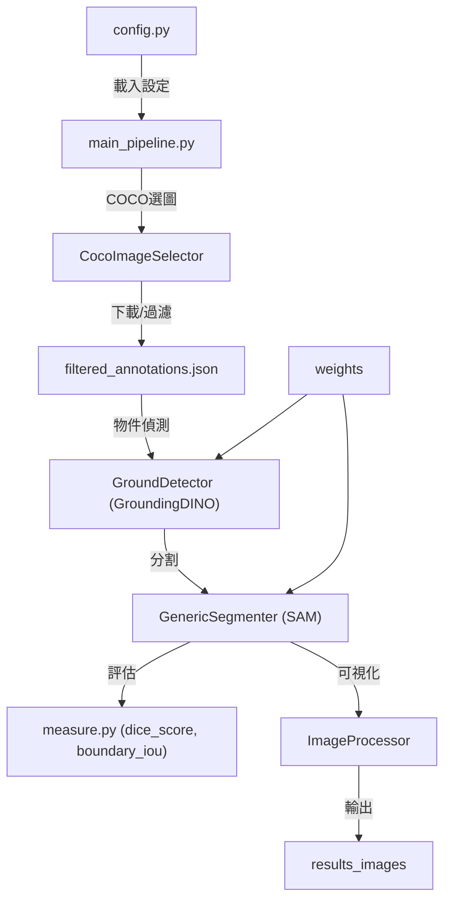

# Metrology AI Pipeline
<p align="center">

</p>


## 1. 專案介紹
本專案為一套自動化影像分析與物件偵測/分割系統，專注於 COCO 資料集動物（特別是貓）之偵測、分割、眼睛定位與評估。整合 GroundingDINO、SAM、COCO API 等多種工具，並提供完整的可視化、評分與 debug 輸出。

demo 影片:https://youtu.be/RNwFvwtW1nw

## 2. 技術棧說明
- Python 3.10
- OpenCV
- NumPy
- pycocotools
- tqdm
- GroundingDINO
- Segment Anything Model (SAM)
- Docker (可選)

## 3. 本地運行步驟
1. 安裝 Python 3.10 版本。
2. 安裝依賴：
   ```bash
   pip install -r requirements.txt
   ```
3. 執行主流程(修改config.py/'choosen_id'可更改輸入圖片)：
   ```bash
   python main_pipeline.py
   ```
4. 下載 COCO annotations 及 images（首次執行會自動下載並過濾需要的資料）。
5. 下載 groundingdino 及 SAM 權重檔（首次執行會自動下載）。


## 4. Docker 部署指令
1. 建立 Docker 映像：
   ```bash
   docker build -t metrology-pipeline .
   ```
2. 啟動容器：
   ```bash
   docker run --gpus all -it metrology-pipeline bash
   ```

## 5. API 文件連結
- [COCO API 官方文件](https://cocodataset.org/#home)
- [GroundingDINO](https://github.com/IDEA-Research/GroundingDINO)
- [Segment Anything (SAM)](https://github.com/facebookresearch/segment-anything)

## 6. 系統架構圖


## 7. 使用了哪些AI模型?
#### 物件偵測 -> GroundingDINO
#### 物件分割 -> Segment Anything Model (SAM)

### 為甚麼用GroundingDINO?
1. 能直接用自然語言表達想找出目標。
2. 作者對COCO資料集做過zero shot，符合題目要求使用的COCO資料集。
3. 論文出處為ECCV 2024。

### 為甚麼用SAM?
1. 出自FAIR。
2. 論文聲稱萬物皆可分割。
3. 接受bbox當輸入，方便與GroundingDINO串接。

## 8. 評估標準公式
本專案使用Dice coefficient與Boundary IoU
### Dice coefficient 原理
Dice coefficient（Dice 相似度係數）用於衡量兩個集合（如預測遮罩與真實遮罩）重疊的程度，公式如下：

$$
	ext{Dice} = \frac{2|A \cap B|}{|A| + |B|}
$$

A、B 分別為預測與真值遮罩，值域為 $[0,1]$，1 代表完全重疊，0 代表完全不重疊。

### Boundary IoU 原理
Boundary IoU（邊界交並比）專注於遮罩邊界的重疊情形，適合評估物件輪廓的精確度。其計算方式為：

1. 將二值遮罩轉換為邊界遮罩（通常以膨脹操作取得邊界）。
2. 分別計算預測與真值邊界遮罩的交集與聯集。
3. 公式如下：

$$
	ext{Boundary IoU} = \frac{|\text{Boundary}_{\text{pred}} \cap \text{Boundary}_{\text{gt}}|}{|\text{Boundary}_{\text{pred}} \cup \text{Boundary}_{\text{gt}}|}
$$

值域同樣為 $[0,1]$，越接近 1 代表邊界越吻合。

## 9. 眼睛距離的量測方式

本專案量測動物（如貓）雙眼距離與兩兩之間的右眼距離，皆採用歐氏距離（Euclidean distance）計算兩眼中心點之間的直線距離。

### 計算步驟
1. 取得兩個眼睛的遮罩（mask）。
2. 使用opencv函式取得兩個遮罩的中心點座標，格式為 $(x_1, y_1, x_2, y_2)$：
   cv2.connectedComponentsWithStats
3. 以歐氏距離公式計算兩中心點距離：
   $$(d = \sqrt{(c_{x1} - c_{x2})^2 + (c_{y1} - c_{y2})^2})$$

### 實作說明
若偵測到的眼睛數量不為2，則回傳-1表示無法量測。
此方法可用於評估模型對於細部結構（如眼睛）定位的精度。

---
如需更多細節，請參閱各模組原始碼與註解。